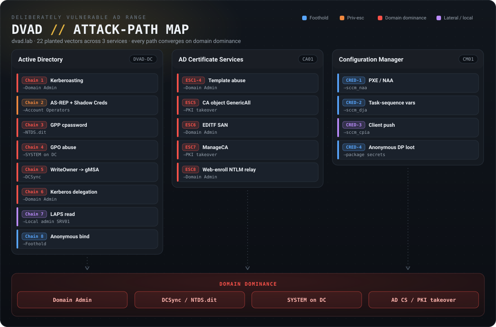
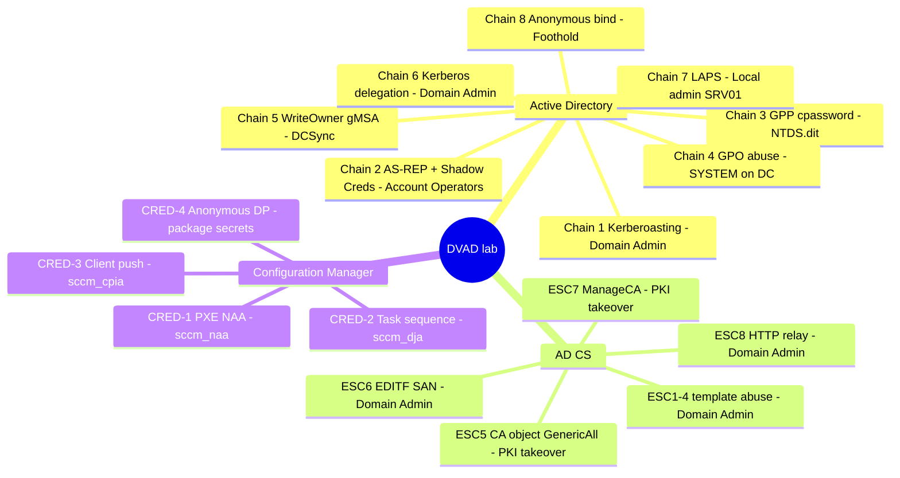

# DVAD — Damn Vulnerable Active Directory

> **A local Active Directory lab for learning AD attacks.** One command builds a deliberately
> vulnerable `dvad.lab` domain on your own machine, with 22 attack paths already planted. Start
> small on a laptop, grow into a full enterprise replica when you want to.

```powershell
git clone https://github.com/Omaar1/DVAD.git
cd DVAD
.\lab.ps1 up          # builds the default 'core' profile: 2 VMs, 4 GB RAM
```

Everything else — profiles, verification, snapshots, troubleshooting — is in
**[INSTALL.md](INSTALL.md)**.

---

## Start small

You do not need a workstation to practise Kerberoasting. Pick the profile that fits your machine:

| Profile | VMs | RAM | Disk | Rough build | What you can practise |
| --- | --- | --- | --- | --- | --- |
| **`core`** *(default)* | DVAD-DC, SRV01 | **4 GB** | ~60 GB | ~37 min | **Chains 1–8** — the AD fundamentals |
| **`adcs`** | + CA01 | 6 GB | ~90 GB | ~52 min | + **ESC1–8** certificate abuse |
| **`full`** | + CM01 | 14 GB | ~120 GB | ~102 min | + **CRED-1…4** SCCM credential theft |

```powershell
.\lab.ps1 profiles              # see them with live numbers from your config
.\lab.ps1 plan -Profile adcs    # dry run: what would be built, in what order
.\lab.ps1 up   -Profile adcs
```

`core` is a complete Chains 1–8 experience, not a crippled preview. The `CA01$` computer object is
pre-staged in the directory even when CA01 itself is not built, so the RBCD path still works.

> Build times are estimates for an SSD, derived from per-VM figures in `lab-config.json`. Your first
> run also downloads a ~5–6 GB base box.

---

## Lab Architecture

```
                    ┌──────────────────────────────┐
                    │       dvad.lab (Forest)      │
                    │            DVAD-DC           │
                    │        10.10.10.100          │
                    └───────────┬──────────────────┘
                                │
         ┌──────────────────────┼──────────────────────┐
         │                      │                      │
┌────────┴────────┐  ┌──────────┴──────┐  ┌───────────┴──────┐
│   CA01          │  │   CM01 / MECM   │  │   SRV01          │
│   Enterprise    │  │   Config Mgr    │  │   Member Server  │
│   Root CA       │  │   + SQL 2019    │  │                  │
│   10.10.10.103  │  │   10.10.10.104  │  │   10.10.10.150   │
│   (adcs, full)  │  │   (full)        │  │   (all profiles) │
└─────────────────┘  └─────────────────┘  └──────────────────┘
```

Domain: `dvad.lab` (NetBIOS `DVAD`). After the DC is up, the remaining VMs are independent of one
another, so `-Parallel` can start them together.

> **Defined in config but not built yet:** `SQL01` (standalone MSSQL, `10.10.10.105`) and `HQ-DC`
> (child domain `hq.dvad.lab`, `10.10.10.101`). `lab.ps1` will tell you they are stubs if you select
> them.

---

## Attack-Path Map

The 22 planted vectors, grouped by service, all converging on domain dominance.

<p align="center">
  
</p>

**[▶ Open the interactive map](assets/attack-map.html)** — fold any vector open for *why it's
vulnerable → action & tools → goal*, plus its target host and plant script. (Open it in a browser or
via GitHub Pages; GitHub does not render HTML inline.)

<details>
<summary>Text version (Mermaid mindmap)</summary>



</details>

> **Edit the maps.** The poster regenerates from [`assets/build-attack-map.py`](assets/build-attack-map.py)
> (`python build-attack-map.py attack-map.svg`, pure stdlib). The interactive map is data-driven —
> edit the `DATA` array in [`assets/attack-map.html`](assets/attack-map.html).

---

## Attack Surface

What is planted and where — the entry principal and the outcome for each path. These mirror the
canonical checks in [`verify-lab-acl.ps1`](verify-lab-acl.ps1). No exploit commands here.

### Active Directory — DVAD-DC (Chains 1–8) · profile `core`

| Chain | Technique | Entry principal | Outcome |
|---|---|---|---|
| **1** | Kerberoasting | `svc_sqldb` — Domain Admin with SPN `MSSQLSvc/SRV01.dvad.lab:1433` and weak password | **Domain Admin** |
| **2** | AS-REP roast → Shadow Credentials | `j.martinez` (pre-auth disabled) → **GenericWrite** on `r.chen` | **Account Operators** |
| **3** | GPP `cpassword` | any user reads SYSVOL `Services.xml` → `svc_backup` | **Backup Operators** → NTDS.dit |
| **4** | GPO abuse | member of `Project-Phoenix` can edit the "DC Security Baseline" GPO (linked to the Domain Controllers OU) | **SYSTEM on the DC** |
| **5** | WriteOwner → gMSA → DCSync | `d.patel` **WriteOwner** on `GMSA-Readers` → reads `gmsa_svc$` (holds replication rights) | **DCSync** |
| **6** | Kerberos delegation | 6a `SRV01$` unconstrained · 6b `svc_web` constrained (`CIFS/DVAD-DC`, protocol transition) · 6c `l.garcia` **GenericWrite** on `CA01$` (RBCD) | **Domain Admin / impersonation** |
| **7** | LAPS | `t.brown` **AllExtendedRights** on `SRV01$` → reads `ms-Mcs-AdmPwd` | **Local admin on SRV01** |
| **8** | Anonymous LDAP bind | unauthenticated; `y.chen`'s password sits in her `description` field | **Foothold** (feeds Chain 4 — `y.chen` is in `Project-Phoenix`) |

### AD Certificate Services — CA01 (ESC1–8) · profile `adcs`

| ESC | Misconfiguration | Who can abuse it |
|---|---|---|
| **ESC1** | Enrollee-supplies-subject template with a client-auth EKU (arbitrary SAN) | Any domain user |
| **ESC2** | Any-Purpose / unrestricted EKU on an enrollable template | Any domain user |
| **ESC3** | Enrollment Agent template (request on behalf of others) | Any domain user |
| **ESC4** | `Domain Users` hold **GenericAll** on a template | Any domain user |
| **ESC5** | `l.garcia` has **GenericAll** on the CA AD object | `l.garcia` |
| **ESC6** | `EDITF_ATTRIBUTESUBJECTALTNAME2` enabled on the CA (arbitrary SAN on any cert) | Any domain user |
| **ESC7** | `a.johnson` holds the **ManageCA** right | `a.johnson` |
| **ESC8** | Web enrollment over HTTP with NTLM (no EPA, no SSL) — relay-vulnerable | Network attacker |

### Configuration Manager — CM01 (CRED-1…4) · profile `full`

| Vector | Misconfiguration | Credential / loot exposed |
|---|---|---|
| **CRED-1 — PXE / NAA** | PXE boot enabled **without** a password | `DVAD\sccm_naa` (Network Access Account) |
| **CRED-2 — Task Sequence Variables** | Task sequence deployed to All Systems with embedded secrets | `DVAD\sccm_dja` + custom OSD variables |
| **CRED-3 — Client Push** | Client push installation account configured | `DVAD\sccm_cpia` (via NTLM coercion) |
| **CRED-4 — Anonymous DP Looting** | Distribution point content readable anonymously | package secrets on the DP |

---

## Key Accounts

Attack-relevant accounts and their starting credentials. The full 50+ user roster is defined in
[`inventory/lab-users.json`](inventory/lab-users.json).

| Account | Password | Role in the lab |
| --- | --- | --- |
| `DVAD\Administrator` | `P@ssw0rd` | Domain Admin on all VMs |
| `DVAD\svc_sqldb` | `Passw0rd` | Kerberoastable Domain Admin — Chain 1 |
| `DVAD\j.martinez` | `P@ssw0rd1` | AS-REP roastable; entry for Chain 2 |
| `DVAD\r.chen` | `Password1` | Account Operators; Chain 2 target |
| `DVAD\svc_backup` | `Trustno1!` | Backup Operators — Chain 3 |
| `DVAD\d.patel` | `S0C#An@lyst2025!` | WriteOwner on `GMSA-Readers` — Chain 5 |
| `DVAD\svc_web` | `Monkey123` | Constrained delegation to `CIFS/DVAD-DC` — Chain 6b |
| `DVAD\l.garcia` | `G@rcia#SysOps2025` | GenericWrite on `CA01$` (RBCD, Chain 6c) + ESC5 |
| `DVAD\t.brown` | `Br0wn#Helpdesk25` | AllExtendedRights on `SRV01$` (LAPS) — Chain 7 |
| `DVAD\y.chen` | `S3n!0rDev#2025Yx` | Password leaked in `description` — Chain 8; in `Project-Phoenix` |
| `DVAD\a.johnson` | `H3lpd3sk#2025!` | ManageCA — ESC7 |
| `DVAD\sccm_naa` | set by SCCM | PXE/NAA credential theft — CRED-1 |
| `DVAD\sccm_cpia` | set by SCCM | Client push NTLM coercion — CRED-3 |
| `DVAD\sccm_dja` | set by SCCM | Exposed via task sequence — CRED-2 |

> **Bonus Kerberoasting:** `svc_web`, `svc_exchange`, `svc_print`, and `svc_fileshare` all carry
> SPNs and are roastable in addition to the Chain 1 target.

---

## Verifying the Build

| Command | Runs on | Checks |
| --- | --- | --- |
| `.\lab.ps1 verify` | host | Reachability, WinRM, expected services, domain membership — for the VMs in your profile |
| [`verify-lab-acl.ps1`](verify-lab-acl.ps1) | the DC | **ground truth** — every Chain 1–8 plant by SID + rights + GUID, group membership, GPO links, SYSVOL cpassword, `dSHeuristics`, the `y.chen` leak |

> **`verify-lab-acl.ps1` is the correctness oracle.** If a doc and the DC disagree, the DC wins.

---

## Break it, then undo it

The point of a practice lab is breaking it. Snapshot once after a clean build and a botched attack
costs seconds instead of a rebuild:

```powershell
.\lab.ps1 snapshot            # after a good build
.\lab.ps1 restore             # back to clean
```

---

## Project Structure

```
DVAD/
├── lab.ps1                     # single entry point: plan/check/deps/up/verify/snapshot/restore
├── Vagrantfile                 # VM definitions and provisioning phases
├── verify-lab.ps1              # profile-aware health check
├── verify-lab-acl.ps1          # DC-side ground-truth attack-path validation
├── README.md / INSTALL.md      # this overview / full setup guide
├── LICENSE
├── assets/                     # attack-map poster, interactive map, generator
├── cache/                      # host-side download cache (gitignored; see cache/README.md)
├── inventory/
│   ├── lab-config.json         # source of truth: domain, hosts, profiles, dependencies
│   ├── lab-users.json          # OUs, groups, users, SPNs, the description leak
│   └── lab-deps.json           # payload manifest (URLs, hashes, which profile needs what)
├── tools/
│   ├── lint-scripts.ps1        # naming / ASCII lint
│   └── lab/                    # plan.psm1, prereq.psm1, deps.psm1, runner.psm1
└── provisioners/
    ├── get-lab-config.ps1      # config loader
    ├── get-lab-payload.ps1     # cached-payload resolver
    ├── domain/                 # forest, directory seed, Chains 1-8 plants
    ├── net/ · host/ · tools/   # networking, base OS, anonymous bind / null session
    └── services/
        ├── ADCS/               # CA install + ESC1-8
        └── SCCM/               # SQL, ADK, MECM + CRED-1..4
```

---

## Roadmap

Built: AD forest and Chains 1–8, ADCS ESC1–8, MECM/SQL and CRED-1…4, profile-driven tooling.

Next: standalone `SQL01`, child domain `HQ-DC` and trust abuse, a bundled attacker VM, guided
per-chain exercises, and a detection layer (Sysmon).

---

## License

[MIT](LICENSE).

> **This lab is intentionally vulnerable.** It disables authentication hardening, leaks credentials,
> and grants dangerous rights on purpose. Run it only on an isolated host-only/NAT network. Never
> expose it to a production or untrusted network, and never reuse its patterns on a real domain.
