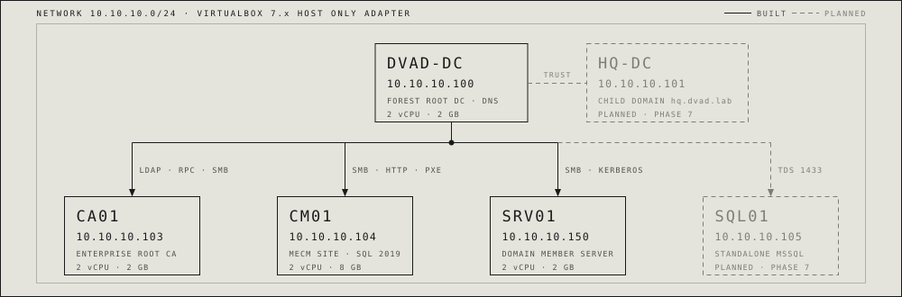

# DVAD - Damn Vulnerable Active Directory

A deliberately vulnerable Active Directory environment you build on your own machine, with one
command, in about half an hour.

Learning to attack Active Directory has an awkward prerequisite: you need an Active Directory to
attack. Building one by hand teaches you a lot about installing Windows Server and very little about
Kerberos, and the public ranges that already exist are either shared, throttled, or someone else's
idea of a scenario. DVAD is the other option. It stands up a `dvad.lab` forest on your laptop with
the attack paths already planted, it is yours to break completely, and restoring it to a clean state
takes seconds.

```powershell
git clone https://github.com/Omaar1/DVAD.git
cd DVAD
.\lab.ps1 up            # default 'core' profile: 2 VMs, 4 GB RAM, ~37 min
```

| I want to... | Go to |
| --- | --- |
| Install the prerequisites and build it | [INSTALL.md](INSTALL.md) |
| Understand the payload cache | [cache/README.md](cache/README.md) |

---

## Pick a size

The lab is profile-driven. A profile decides which VMs get built, and every threshold that follows
from that (RAM, disk, which payloads to download, what the health check expects to find) is derived
from it rather than hardcoded.

| Profile | VMs | RAM | Disk | Rough build | What you can practise |
| --- | --- | --- | --- | --- | --- |
| `core` *(default)* | DVAD-DC, SRV01 | 4 GB | ~60 GB | ~37 min | The AD chains, the fundamentals |
| `adcs` | + CA01 | 6 GB | ~90 GB | ~52 min | + certificate abuse (ESC) |
| `full` | + CM01 | 14 GB | ~120 GB | ~102 min | + SCCM credential theft |

Start with `core`. It carries the whole Active Directory surface on two VMs that fit on a laptop, and
you can add `CA01` or `CM01` later without rebuilding what you already have. The `CA01$` computer
object is pre-staged in the directory even when CA01 itself is never built, so the RBCD path still
works on a two-VM lab.

```powershell
.\lab.ps1 profiles              # the same table, with live numbers from your config
.\lab.ps1 plan -Profile adcs    # dry run: what would be built, in what order
```

---

## Architecture

<picture>
  <source media="(prefers-color-scheme: dark)" srcset="docs/architecture-dark.svg">
  
</picture>

Domain `dvad.lab` (NetBIOS `DVAD`) on an isolated `10.10.10.0/24` host-only network. Once the DC is
up the other VMs are independent of one another, so they can be built in any order or concurrently.

`SQL01` and `HQ-DC` appear in the config but are not built yet; the tooling tells you they are stubs
if you select them. See the roadmap for what they are for.

You bring your own attacking machine. Putting it on the lab subnet is three steps and they are
written out at the end of [INSTALL.md](INSTALL.md#7-your-attacking-machine).

---

## What is planted

Misconfigurations across three services, each of them a chain that ends at domain dominance. The set
grows as the lab does, so treat what follows as the shape of the surface rather than a fixed count.

- **Active Directory** - Kerberoasting, AS-REP roasting and shadow credentials, GPP `cpassword`, GPO
  abuse, gMSA to DCSync, delegation in all three flavours (unconstrained, constrained, RBCD), LAPS,
  and anonymous LDAP bind.
- **Certificate Services** - vulnerable templates, CA object and `ManageCA` rights,
  `EDITF_ATTRIBUTESUBJECTALTNAME2`, and HTTP web enrollment for relay.
- **Configuration Manager** - unauthenticated PXE, task-sequence variables, client push, and
  anonymous distribution-point looting.

Each chain has exactly one unique entry vector and one unique win, so nothing is solvable two ways by
accident and finishing one does not hand you the answer to the next.

There is no credential list and no index of what is planted where. You do not need one. Anonymous
LDAP bind is open, which gives you the user roster; one of those users left a password somewhere it
does not belong, which gives you a foothold; and from a foothold the rest of the directory is
enumerable with the same tools you would use on a real engagement. Working out what is wrong with
this domain **is** the exercise. If you get genuinely stuck, the provisioners under
[`provisioners/domain/`](provisioners/domain/) and
[`provisioners/services/`](provisioners/services/) are what plant all of it, and reading them is a
deliberate act rather than something you stumble into.

---

## After the build

```powershell
.\lab.ps1 verify        # reachability, WinRM, services, domain membership
.\lab.ps1 snapshot      # freeze a clean build
.\lab.ps1 restore       # undo a session's damage in seconds
```

Take the snapshot. You are meant to break this lab, half the chains end in DCSync or SYSTEM on the
domain controller, and a botched attack should cost you seconds rather than another 37 minutes.

---

## Roadmap

**Working today.** The `dvad.lab` forest with its Active Directory chains, an Enterprise Root CA with
the certificate templates and CA rights planted, an MECM site on SQL Server with the credential
material exposed, and the profile-driven tooling that builds, verifies, snapshots and restores all of
it.

**Being built next**, roughly in this order:

| | Why it is next |
| --- | --- |
| **MSSQL attack surface** on the `SQL01` member server | Database links, `xp_cmdshell`, `IMPERSONATE` chains and service-account escalation. Currently the largest gap in what the lab teaches; SQL Server is the most common way onto a Windows estate that DVAD does not yet cover. |
| **Cross-forest and cross-domain attacks** | The `HQ-DC` child domain (`hq.dvad.lab`) and a second forest across a trust. SID history and SID filtering, cross-forest Kerberos, and why a child domain was never a security boundary. Needs `HQ-DC` finished first. |
| **Guided exercises** | Per-chain walkthroughs with an objective, a starting position, and hints that reveal in stages rather than all at once. |
| **A detection layer** | Sysmon and Windows event forwarding, so the same chains can be run from the defensive side and you can see what each one leaves behind. |

`SQL01` and `HQ-DC` already exist in [`inventory/lab-config.json`](inventory/lab-config.json) with
addresses and roles assigned; their blocks in the `Vagrantfile` are commented out until the
provisioners land.

---

## License

[MIT](LICENSE).

> **This lab is intentionally vulnerable.** It disables authentication hardening, leaks credentials,
> and grants dangerous rights on purpose. Run it only on an isolated host-only/NAT network. Never
> expose it to a production or untrusted network, and never reuse its patterns on a real domain.
